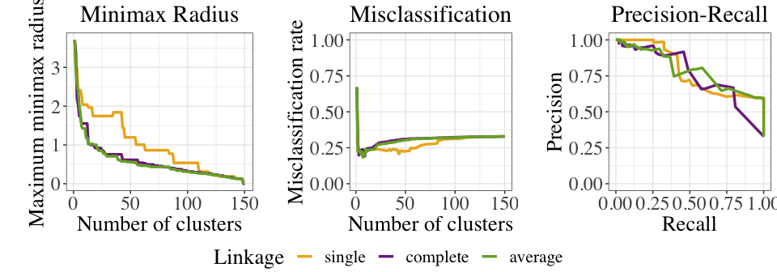
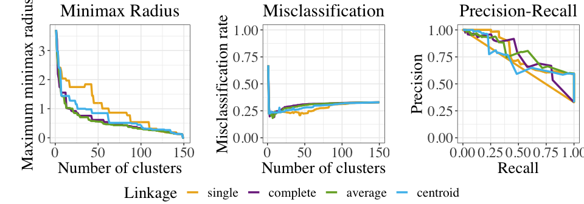

<!-- README.md is generated from README.Rmd. Please edit that file -->

```{r, echo = FALSE}
knitr::opts_chunk$set(
  collapse = TRUE,
  comment = "#>",
  fig.path = "README-"
)
```

```{r setup, message=FALSE, warning=FALSE, echo=FALSE}
################################################################################
# DEFAULT SETTINGS
################################################################################
knitr::opts_chunk$set(message = FALSE) # don't knit messages
knitr::opts_chunk$set(warning = FALSE) # don't knit warnings
```

# clusterTruster

This is a package to benchmark linkages in hierarchical clustering. Please see our paper on arXiv for more detailed examples: https://arxiv.org/abs/1906.03336. The authors of the paper and this package are Xiao Hui Tai (https://xhtai.github.io/) and Kayla Frisoli (http://stat.cmu.edu/~kfrisoli/).

## Installation

You can install `clusterTruster` from GitHub with:

```{r gh-installation, eval = FALSE}
devtools::install_github("xhtai/clusterTruster", build_vignettes = TRUE)
library(clusterTruster)
```

## Reproducing paper results
The package contains a vignette with code to reproduce the results in our paper. To view the vignette, you would have had to install the package with the option `build_vignettes = TRUE`. You can then view the vignette using 

```{r, eval = FALSE}
vignette("reproducePaperResults", package = "clusterTruster")
```


## Examples

### iris

We can analyze the iris data set as follows. We first center and scale the four features, "Sepal.Length", "Sepal.Width", "Petal.Length", "Petal.Width", and generate the l2 distance between all pairs. We then use various linkage methods to generate all associated evaluation metrics.

```{r, eval = FALSE}
myPairwise <- clusterTruster::genPairwise(iris, 5)
iris[, 1:4] <- scale(iris[, 1:4])
myPairwise <-
  clusterTruster::genSimDiff(iris, 1:4, myPairwise, 1:2, "l2dist")
```


Note that the following code could take a while to run.

```{r, eval = FALSE, cache=TRUE}
outMetrics_iris_single <- clusterTruster::getMetrics(
  myPairwise,
  pairColNums = 1:2,
  matchColNum = 3,
  distSimCol = "l2dist",
  linkage = "single"
)
outMetrics_iris_complete <- clusterTruster::getMetrics(
  myPairwise,
  pairColNums = 1:2,
  matchColNum = 3,
  distSimCol = "l2dist",
  linkage = "complete"
)
outMetrics_iris_average <- clusterTruster::getMetrics(
  myPairwise,
  pairColNums = 1:2,
  matchColNum = 3,
  distSimCol = "l2dist",
  linkage = "average"
)
outMetrics_iris_centroid <- clusterTruster::getMetrics(
  myPairwise,
  pairColNums = 1:2,
  matchColNum = 3,
  distSimCol = "l2dist",
  linkage = "centroid"
)
outMetrics_iris_minimax <- clusterTruster::getMetrics(
  myPairwise,
  pairColNums = 1:2,
  matchColNum = 3,
  distSimCol = "l2dist",
  linkage = "minimax"
)
```

#### Plotting linkage method results for iris

To compare single, complete, and average:

```{r, fig.height=3.5, fig.width=10, fig.align='center', eval = FALSE}
clusterTruster::plotResultsGG_base(
  single = outMetrics_iris_single,
  complete = outMetrics_iris_complete,
  average = outMetrics_iris_average,
  correlation = FALSE,
  write_plot = FALSE,
  plot_type = c("all", "minimax", "misclass", "pr")
)
```


To compare all:

```{r, fig.height=3.5, fig.width=10, fig.align='center', eval = FALSE}
clusterTruster::plotResultsGG_base(
  single = outMetrics_iris_single,
  complete = outMetrics_iris_complete,
  average = outMetrics_iris_average,
  centroid = outMetrics_iris_centroid,
  minimax = outMetrics_iris_minimax,
  correlation = FALSE,
  write_plot = FALSE,
  plot_type = c("all", "minimax", "misclass", "pr")
)
```



## License
The `clusterTruster` package is licensed under GPLv3 (http://www.gnu.org/licenses/gpl.html).
